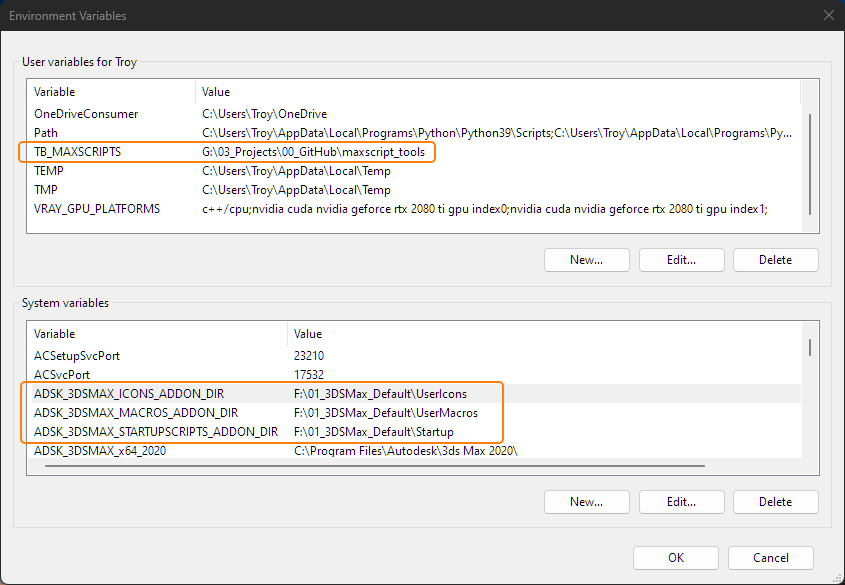
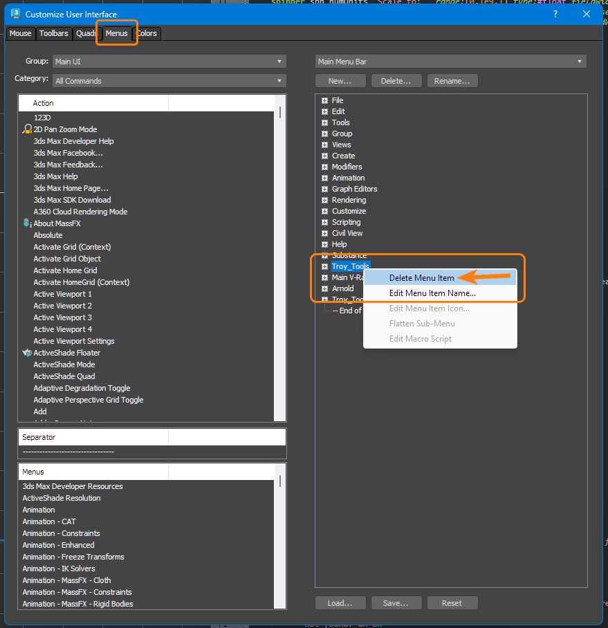

# Troy MaxScript Automation Tools

Private repository for Troy's custom workflow scripts and utilities for 3DS Max. Scripts have been tested with 3DS Max 2021 - 2024.

A few key features of these tools:
* 3DS Max is setup using system variables to define system folders for user script locations simplifying deployment across all artist machines
* 3DS Max startup script to setup 3DS Max to the specific requirements of the studio, including system units and many other settings
* Easy update / deployment strategy
* All tools have usage information contained within the UI, making it easy for artists to know how to use new tools as they appear
* Includes detailed information for the script to help with troubleshooting should scripts get out of sync on artist's machine


Tool descriptions and demo videos can be found in the documentation links below or navigate to the documentation folder. Documentation includes basic usage and information regarding the technical details required for each script. All scripts have instructions within the GUI for how to use the tool for quick and easy user reference. These rollouts can be minimized by default by simply updating the maxscript addRollout lines. See example below.


```maxscript
-- To make a rollout be collapsed when the script opens
-- Set the rolledup tag to be true

WSUVT_rf = newRolloutFloater ("World Scale UV Tiling Utility v" + Build_Version) UI_Width UI_Height lockHeight:true lockWidth:true

addRollout _SRlt_WSUVT_Instructions WSUVT_rf rolledUp:true
addRollout _SRlt_WSUVT_Create WSUVT_rf rolledup:false
addRollout _SRlt_WSUVT_Info WSUVT_rf rolledup:true
```


### Script Deployment Instructions
* [Installation](#installation)
* [Uninstallation](#uninstallation)


# MaxSript Library Index

### Camera Animation Key Reducer
This script was developed to stabilize camera animation created from VR headsets within 3DS Max.  
**Documentation:** [Camera Animation Key Reducer](documentation/Camera%20Animation%20Key%20Reducer/TB_CameraAnimKeyReduction.md)

### Material ID By Face Normals
This script will assign a material ID based on the objects face normal direction within a given angle falloff. X, Y, and Z directions can be assigned a custom material ID number.  
**Documentation:** [Material ID By Face Normals](documentation/Assing%20MatID%20By%20Normal/TB_MatIDByFaceNormals.md)

### Merge Max Files to Layers
This script will merge all max files, in the provided folder, into the current 3DS Max scene. The contents of each merged max file will be placed on a new layer with the name of the source Max file.  
**Documentation:** [Merge Max Files To Layer Documentation](documentation/Merge%20Max%20Files/TB_MergeMaxFilesToLayers.md)

### Layers From Object Names
This script will go through all objects within the Max file and assign them to a new layer matching the object's name.  
**Documentation:** [Layers From Object Names Documentation](documentation/Layers%20From%20Object%20Names/TB_LayersFromObjectNames.md)

### Create PBR VRay Material Library
This tool looks into a source folder for PBR textures and creates a VRay Material for each PBR texture set. Additionally, the VRay Material is setup so the artist only needs to change the bitmap tiling in one node and automatically updates the others. Once all the materials are created, the artist can quickly save out a material library.  
**Documentation:** [Create PBR VRay Material Library](documentation/Create%20VRay%20PBR%20Material/TB_CreateVRayPBRLibrary.md)

### Auto UV Unwrap Unwrella
This tool will take the selected object(s) and use the Unwrella plugin to UV Unwrap the UVs. This is a non-destructive process leaving the modifier in the stack should additional adjustments be needed beyond the predefined standards.  
**Documentation:** [Auto UV Unwrap Unwrella](documentation/Auto%20UV%20Unwrella/TB_AutoUVUnwrella.md)

### Model Asset Prep
This script is used to process 3D models and prepare them for import into Unreal. Options to control what process(es) to run on the assets. The main function of this script is to create consistency within the asset development process and serve as a validation utility making sure the models are setup correctly before being exported to Unreal.  
**Documentation:** [Model Asset Prep Documentation](documentation/Model%20Asset%20Prep/TB_ModelAssetPrep.md)

### Reorder Material IDs
This script will remove any gaps within the material ID numbers assigned to the model, and a new MultiSub material will be generated for the object.  
**Documentation:** [Reorder MAterial IDs Documenation](documentation/Reorder%20Material%20IDs/TB_ReorderMaterialIDs.md)

### UV Channel Cleaner
This script removes missing UV channel data preventing Unreal from moving UV data to a different UV channel.  
**Documentation:** [UV Channel Cleaner Documentation](documentation/UV%20Channel%20Cleaner/TB_UVChannelCleaner.md)

### World Scale UV Tiling
This script scales the UVs to match the provided dimensions in relationship to the model.  
**Documentation:** [World Scale UV Tiling Documentation](documentation/World%20Scale%20UV%20Tiling/TB_WorldScaleUVTiling.md)

### UV Scale Check
This script will create a reference 1m cube and apply a checker material representing the universal UV scale. This same material is then applied to the asset for QC visual inspection of the UVs. Options for adjusting the model UV scale provided to easy QC fixes.  
**Documentation:** [UV Scale Check Documentation](documentation/UV%20Scale%20Check/TB_UVScaleCheck.md)

### Quick FBX Export
This script quickly exports the currently open Max file bypassing all pop-up dialogs and settings.  
**Documentation:** [Quick FBX Export Documentation](documentation/Quick%20FBX%20Export/TB_QuickFBXExport.md)

### DataSmith Scene Export
This script automates exporting a DataSmith file out of 3DS Max. Works on both the entire scene or on the selected layers.  
**Documentation:** [DataSmith Scene Export Documentation](documentation/DataSmith%20Scene%20Export/TB_SceneExportTool.md)


# _______________________________________________
# Installation

1. Create a user environment variable named `TB_MAXSCRIPTS` on the machine and set it to the github root `maxscript_tools` folder.

    (e.g. `G:\03_Projects\00_GitHub\maxscript_tools`)

2. Setup System Environment Variables now supported in 3DS Max 2022+
* Startup Directory: **ADSK_3DSMAX_STARTUPSCRIPTS_ADDON_DIR** variable to e.g. *'F:\01_3DSMax_Default\Startup'*
* Macros Directory: **ADSK_3DSMAX_MACROS_ADDON_DIR** variable to e.g. *'F:\01_3DSMax_Default\UserMacros'*
* User Icons Directory: **ADSK_3DSMAX_ICONS_ADDON_DIR** variable to e.g. *'F:\01_3DSMax_Default\UserIcons'*

When setup correctly, the system variables should look like the following image.


3. Run the `autoupdate/user_install.bat` script to automatically load scripts from the server everytime you start max.
4. Restart 3dsmax.


# Uninstallation

1. Remove the `TB_MAXSCRIPTS` environment variable created during installation.
2. Run the `autoupdate/user_uninstall.bat` script to remove all files installed by the install script.
3. You will need to manually remove the Troy_Tools menu from 3dsmax as well. You can do this by going to:
    * `Customize -> Customize User Interface`
    * Goto the `Menu` tab
    * In the right-pane, right-click on `Troy_Tools` and press `Delete Menu Item`
    * Restart 3dsMax

