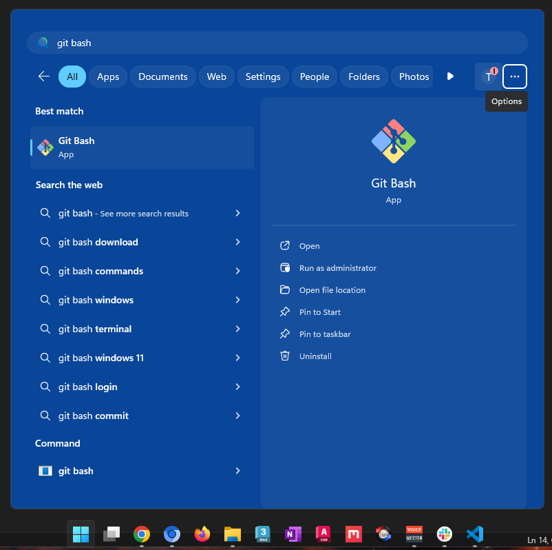
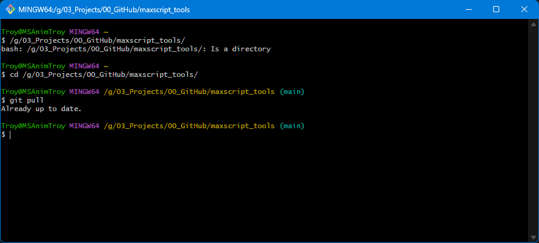
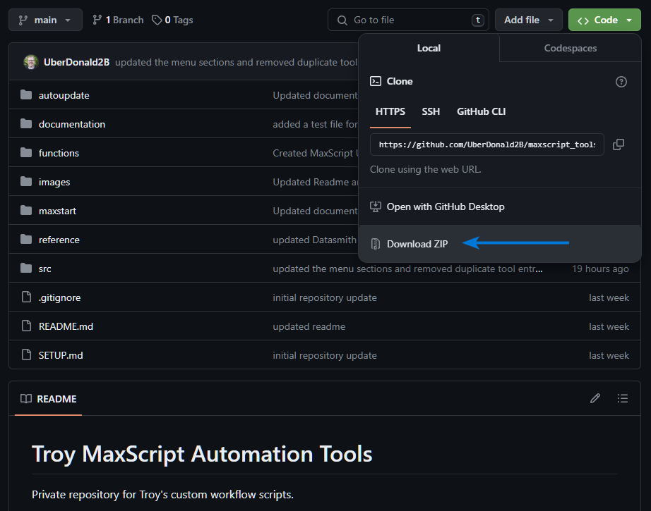

# Git setup instructions

# One-time setup

You only need to do this setup once.

1. Download and install a Git client for windows (https://gitforwindows.org/)
2. Press the windows key and search for "Git Bash"

3. With the `cd` (change directory) command navigate to the folder where you want to save the scripts to locally. (Note: `C:\` is mapped to `/c/`, so if you want to save them to `C:\Scripts\` you would enter `cd /c/Scripts`).

4. Type `git clone https://github.com/UberDonald2B/maxscript_tools.git`. This will create a new folder `maxscript_tools\` in `C:\Scripts\`. Git Bash might ask for your github credentials the first time you do this since the repository is private to ensure you have proper access.

---

# Pulling Latest versions

Once you're setup with the initial setup, if any changes are made to the repository since the last time you `git pull` or `git clone` you'll need to pull those changes down to see the newer version.

1. In Git Bash, navigate to the folder where you initially cloned the files with the `cd` command.
2. Run `git pull` to pull the latest changes to the repo. (You'll know if you're in the right directory if you see `(main)` on the command line).

---

# Non-git workflow

1. If you prefer to just download the repository and the latest version easily instead of `git pull`-ing, or doing any git installation at all, you can easily access all the files as a zip archive.

