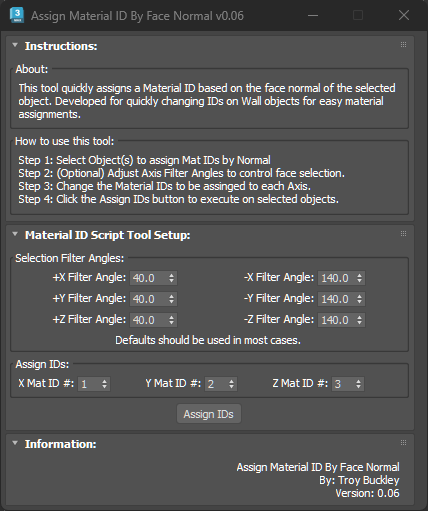
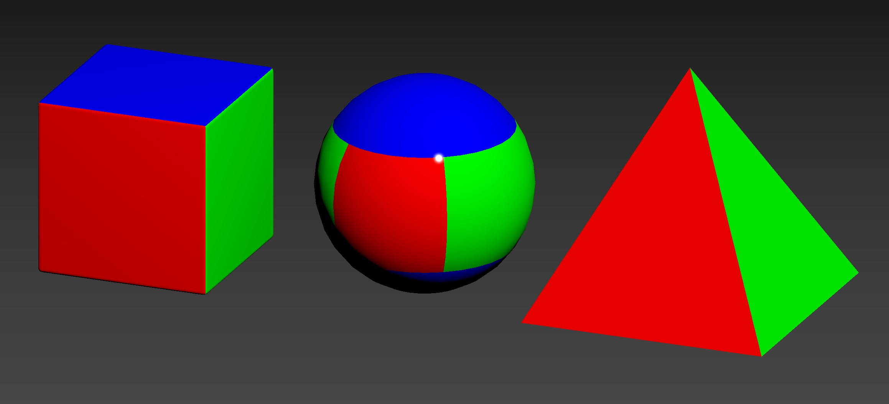
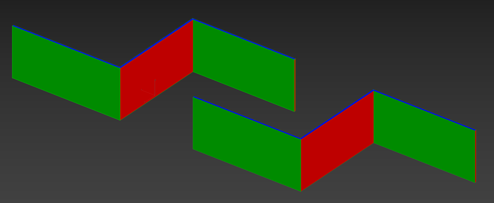

# TB_MatIDByFaceNormals Script

## Demo
!! Coming Soon !!

## About / Usage
This script was developed to help artists creating walls and assigning different materials based on the face's normal direction. The top and bottom faces of the walls needed to have their own Material ID separate from the interior and exterior wall faces. This script takes the normal direction and based on the filter angle will then assign a material ID onto the face.

## Options
* Adjust Filter Angles for organic objects to control the sensitivity of the axis direction
* Set custom material ID numbers to fit production pipeline

## Results Screenshots

