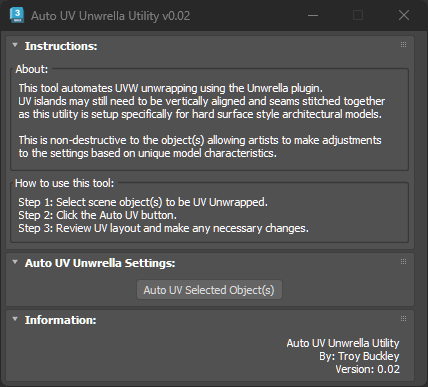
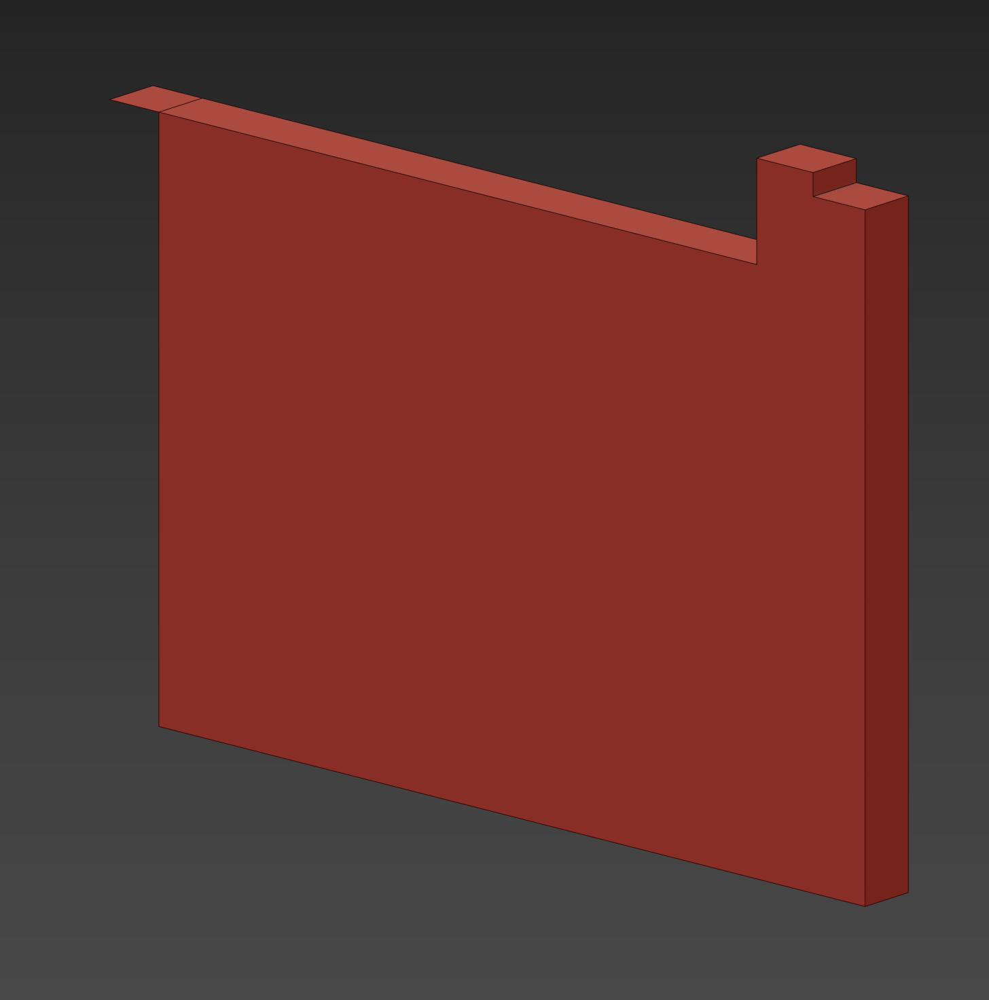
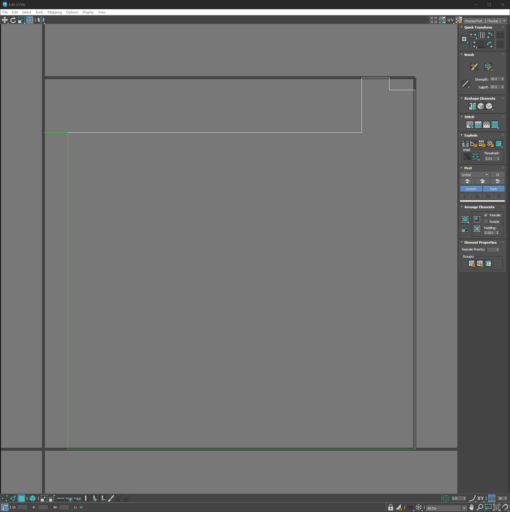
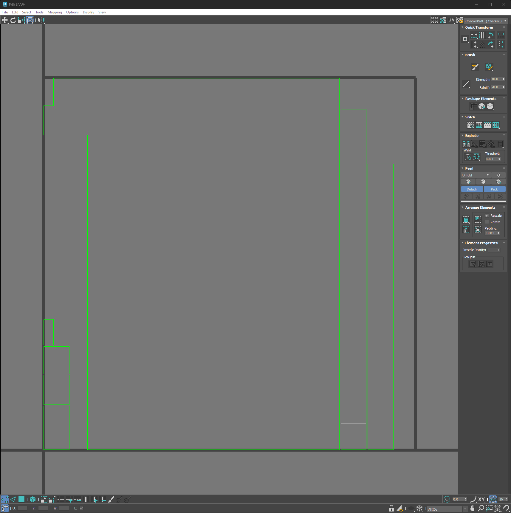

# TB_AutoUVUnwrella Script
  

## Demo
***!! Coming Soon !!***

## About / Usage
This tool will take the selected object(s) and use the Unwrella plugin to UV Unwrap the UVs. This is a non-destructive process leaving the modifier in the stack should additional adjustments be needed beyond the predefined standards.  
This isn't a fully comprehensive Auto UV tool, but merely a quick way to assign the Unwrella modifier to a large number of selected objects and then process them. The base settings are specifically setup for hard surface models and may not be effective for more organic objects.  
Additionally, the UV islands may need to be rotated and possibly stitched together creating a more seemless UV layout. This is very simple to do using the UVW Unwrap modifier on top of the Unwrella modifier and stitching seams.

## Options
* N/A

## Screenshots
Sample Object:  
  

UVs **Before**:  
  

UVs **after**:  

