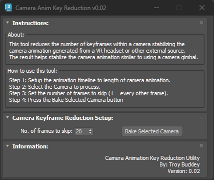
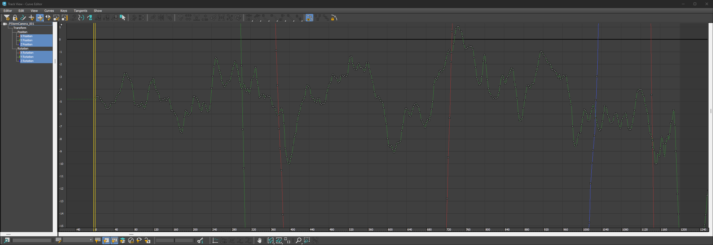
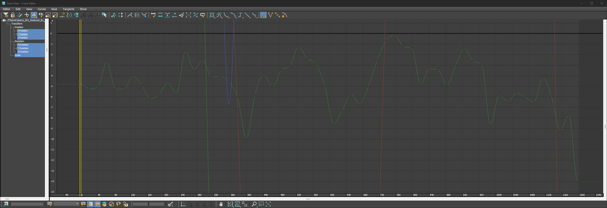

# TB_CameraAnimKeyReduction

## Demo
***!! Coming Soon !!***

## About / Usage
This script was developed to stabilize camera animation created from VR headsets within 3DS Max. The camera animation generated by this method creates too much jitter based on the movements of the user during capture resulting in excessively bouncy animation. By reducing the number of keyframes based on a number of frames to skip will help reduce this jitter and smooth out the animation. Similar to stabilizing the footage of a video file, this script will reduce the amount of jitter and smooth out the animation making it appear as though it was filmed with a gimbal while still maintaining the more natural handheld capture feel.

## Options
* Adjust how many frames to skip (Higher numbers = smoother animation)

## Results Screenshots
**Animation Curve Before**

**Animation Curve After**
