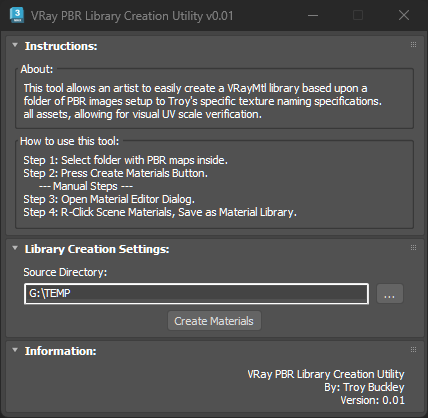
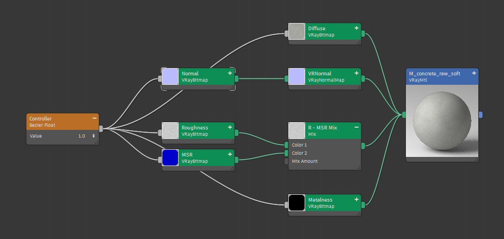
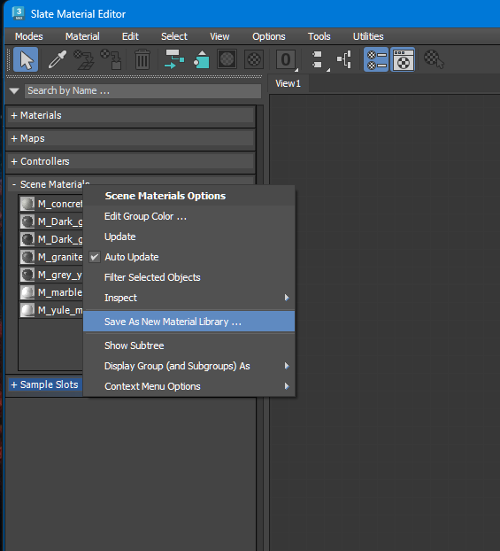

# TB_CreateVRayPBRLibrary Script

## Demo
***!! Coming Soon !!***

## About / Usage
This tool looks into a source folder for PBR textures and creates a VRay Material for each PBR texture set. Additionally, the VRay Material is setup so the artist only needs to change the bitmap tiling in one node and automatically updates the others. Once all the materials are created, the artist can quickly save out a material library.

## Options
* Set PBR map source folder

## Screenshots
VRay PBR Material Setup  

Save As Material Library Help  
