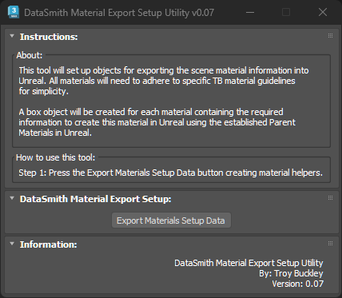
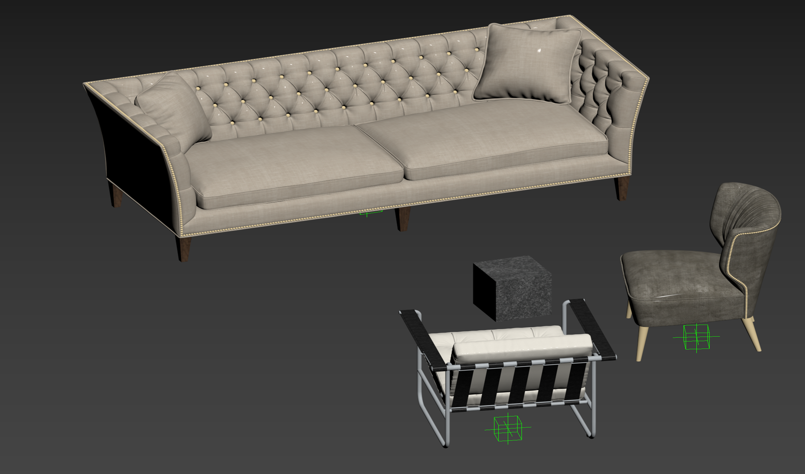
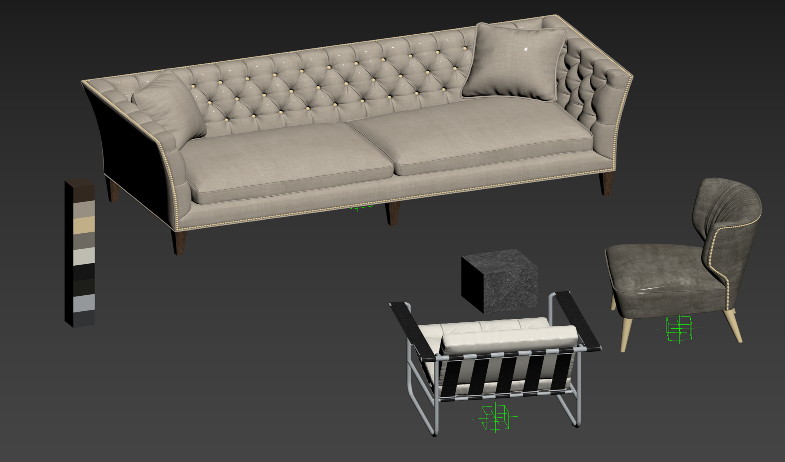
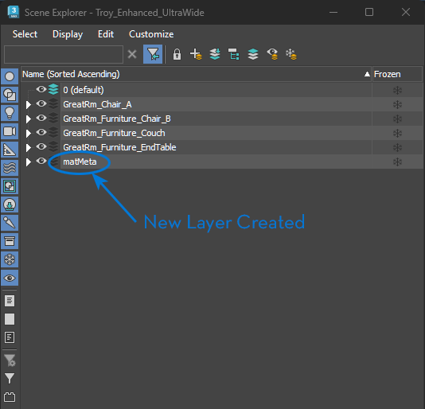

# TB_DataSmithMaterialExport Script  

## Demo
***!! Coming Soon !!***  

## About / Usage  
This tool will create box objects, to store metadata information, for exporting scene materials into Unreal.  
**NOTE:** All materials will need to adhere to specific TB material guidelines for simplicity.  
A box object will be created for each material containing the required metadata information required to create the material in Unreal using established Master Shaders in Unreal.

## Options
* N/A

## Screenshots
Viewport **BEFORE** running script:  
  

Viewport **AFTER** running script:  
  

Layer Manager **AFTER** running script:  
