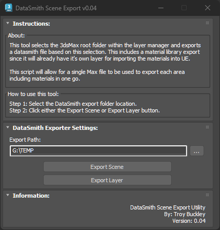

# TB_SceneExportTool Script

This tool will select each main folder in the layer manager within 3DS Max, and export a datasmith file based on this selection. This includes a material library export since it will already have it's own layer for importing the materials into UE. This script will allow for a single Max file to be used to export each area including materials in one go.

## Demo
https://player.vimeo.com/video/930541645?h=c20b9bec95

## About / Usage
The script automates exporting a DataSmith file out of 3DS Max based on the production pipeline requirements. This will look for the materials layer and export this as a separate DataSmith file allowing for easy processing of all materials independently of the scene.

## Requirements
This script requires the 3dsmax Datasmith Exporter plugin found here:
	https://www.unrealengine.com/en-US/datasmith/plugins

## Reference documents:
	https://docs.unrealengine.com/4.26/en-US/WorkingWithContent/Importing/Datasmith/SoftwareInteropGuides/3dsMax/MAXScriptInterface/
