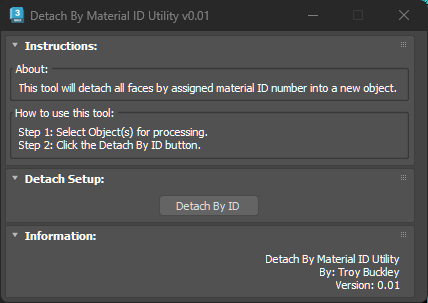
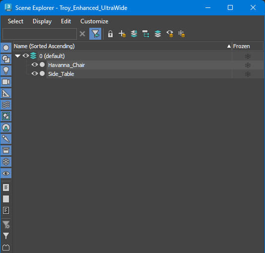
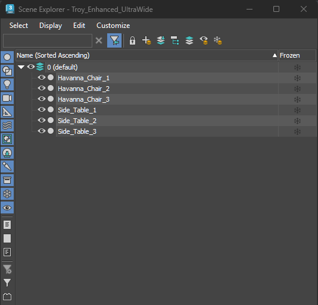

# TB_DetachByMaterialID Script

## Demo
***!! Coming Soon !!***

## About / Usage
This script was developed to quickly separate an single object into individual meshes based on the material ID assigned to an object's face. This was needed to help reduce the Auto UV times by quickly separating a complex object to just the elements needing new UVs. Artist can now quickly explode a single mesh and then select just the pieces for further processing. Each new object will retain the original name followed by the material ID number assigned to those faces.

## Options
* Add a passive check to only operate on editable poly or editable mest objects and ignore all other object types to reduce script errors due to incompatible object types

## Results Screenshots
**BEFORE**  
  
**AFTER**  
