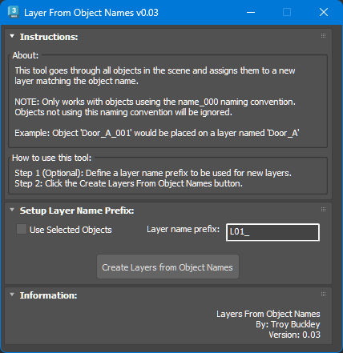

# TB_LayersFromObjectNames Script

## Demo
https://player.vimeo.com/video/930541653?h=298e6ba4be

## About / Usage
This script goes through all objects in the scene and assigns them to a new layer matching the object's name.

**NOTE:** This only works with a specific naming convention used within this particular production environment. Objects will need to utilize the _000 naming convention where the numbers define the number of instances / copies of a model. If an object doesn't utilize this naming convention it will be ignored by the script.

**Example:** Objects "Door_A_001", "Door_A_002", and "Door_A_003" will all be placed on a new layer named "Door_A"

## Options
* Toggle the option for using just the selected objects instead of processing the entire scene
* Add a prefix to the layer names for additional scene / layer organization