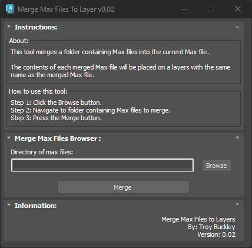

# TB_MergeMaxFilesToLayers Script

## Demo
https://player.vimeo.com/video/930541665?h=ce7e63eec2

## About / Usage
When working with large amount of assets, it can be time consuming merging assets into the main 3DS Max scene file. This script will merge all max files within the provided folder into the current Max scene.

The contents of each merged file will be placed on a layer with the same name as the source Max file.

This makes it easy to quickly and easily select an asset or maintain a proper layer structure within the master 3DS Max file. More importantly, this greatly reduces the artists time manually importing each Max file by hand.

## Options
* Select the source folder containing the Max files to merge with current scene