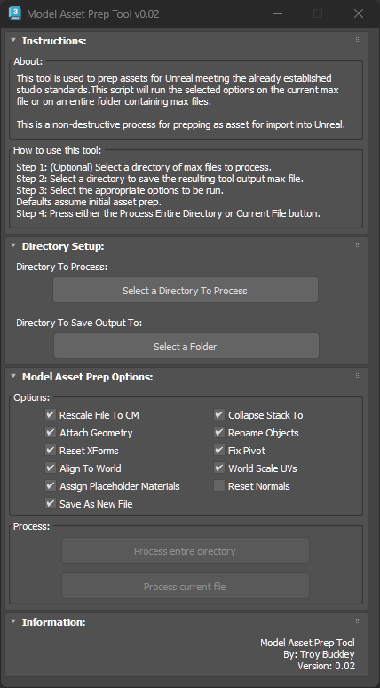

# TB_ModelAssetPrep Script


## Demo
https://player.vimeo.com/video/930541676?h=a8466d420b


## Example maxscript usage:
```maxscript
fileIn "includes/ModelAssetPrepLib.ms"

process_options = ProcessOptions()	-- All options are on by default
process_options.RescaleToCm = false	-- Only needed to unset some options

local success = ProcessFile @"C:\Max\Scene.max" @"C:\Max\output" options:process_options

if (not success) then ( ... )
```


## About / Usage
This script is used to process 3D models and prepare them for import into Unreal. Options to control what process(es) to run on the assets. The main function of this script is to create consistency within the asset development process and serve as a validation utility making sure the models are setup correctly before being exported to Unreal.

Asset specifications we're setup in the following design specification document. **Link Coming Soon!**

Having the ability for artist to quickly batch process an entire directory of assets and validate everything is setup correctly greatly improves the QC process for models, but assures the assets coming into Unreal are correctly setup in relationship to each other while also meeting the minimum model specifications.


## Options
* ✅ Rescale scene to cm
* ✅ Collapse stack
* ✅ Collapse Geo into single object
* ✅ Reset Xform
* ✅ Properly place Pivot point
* ✅ Center / align object to world
* ✅ Assign Box mapping
* ✅ Remove all materials from the Multi-Sub material
* ✅ Replace multi-sub materials with standard material using bright colors * Name (Mat_01, 02, etc)
* ✅ Properly name object(s)
* ✅ Save new Max file w/ proper name.

