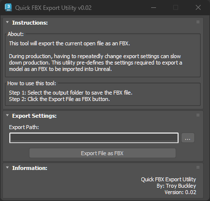

# TB_QuickFBXExport Script

## Demo
https://player.vimeo.com/video/930541686?h=8e79585fb1

## About / Usage
This script quickly exports the currently open Max file bypassing all pop-up dialogs and settings.

During production, having to repeatedly change export settings for each asset export reduces artist efficiency. This utility pre-defines the FBX export settings required to export a model as an FBX model to be imported into Unreal.

## Options
* define the FBX export folder