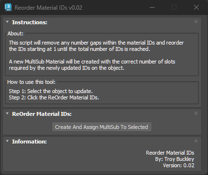

# TB_ReorderMaterialIDs Script

## Demo
https://player.vimeo.com/video/930541693?h=c3684854f7

## About / Usage
This script will remove any number gaps within the material IDs assigned to an object. In many cases, it's common for some assets to have large gaps in the material ID numbers due to their construction. This creates a problem when preparing the asset to be merged into Unreal. When Unreal encounters a gap in the Material IDs, the rest of the remaining Material IDs are ignored resulting in missing texture slots on the imported Static Mesh asset.

This tool was designed to address this problem and verify all materials are properly setup. In addition to removing all of the ID gaps, a new MultiSub material will be created and assigned to the asset. This allows for the artist to quickly review all the IDs are setup correctly and nothing was missed.

## Options
No options for this script.

## Future Enhancements
* The model needs to have a material assigned to it in order for the script to run correctly. The fix is to check if there is no material, assign a temporary material preventing the script from crashing.