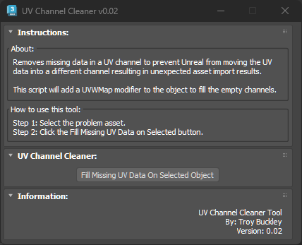

# TB_UVChannelCleaner Script

## Demo
https://player.vimeo.com/video/930541702?h=cffcffb61e

## About / Usage
This script removes missing UV channel data preventing Unreal from moving UV data to a different UV channel creating unexpected results when applying textures or baking out lighting.

The script will add a UVWMap modifier to the object to fill the empty channel(s).

This was developed as the asset team wanted to use UV channel 1 (3DS Max) for baked lighting and UV Channel 2 (3DS Max) for textures. After moving over to Lumen, the assets no longer required the need for baked lighting UVs, resulting in UV Channel 1 being empty for many assets. This script fixes this issue for assets where this is a problem.

## Options
No options for this script.