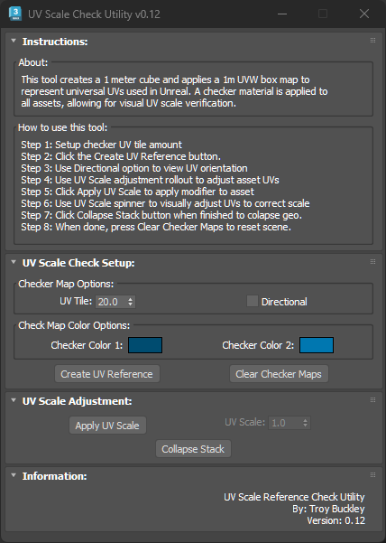

# TB_UVScaleCheck Script

## Demo
https://player.vimeo.com/video/930541713?h=24f93a7426

## About / Usage
This script will create a reference 1m cube and apply a checker material representing the universal UV scale. This same material is then applied to the asset for QC visual inspection of the UVs. Options for adjusting the model UV scale provided to easy QC fixes.

Providing a simple and easy interface to allow the QC or Model artist to verify UVs greatly improves turn around time on assets.

See the below options for alternate modes for verifying correct UV island orientation. (Example: Wood graining having the correct orientation)

## Options
* Adjust the size of the checker map for use on large / small objects
* Check directional option to stretch the checker map in one direction to verify UV island orientation
* Change colors of the checker map
* Apply a UV Scale to asset and dynamically adjust scale within the tool to correct for any UV scale issues