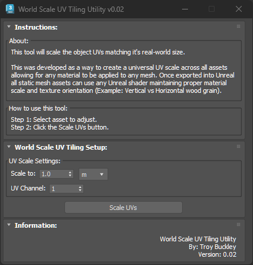

# TB_WorldScaleUVTiling Script

## Demo
https://player.vimeo.com/video/930541726?h=57ca7a0b0e

## About / Usage
This script scales the UVs to match the real-world size of the object.

This was developed as a way to create a universal UV scale across all model assets allowing for any tilable material to be applied to any mesh. Once exported into Unreal, all StaticMesh assets can use any Unreal material maintaining proper material scale and texture orientation.

Example: Wood grain maintains vertical and horizontal wood grain orientation.

## Options
* Adjust the size to scale the UVs (Defaults to 1 meter)
* Choose which UV channel to scale (Defaults to UV channel 1)